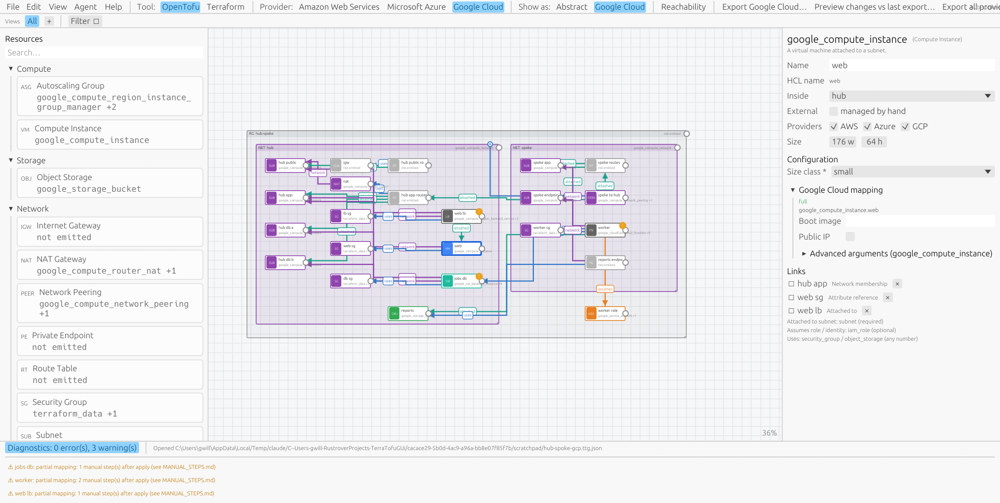
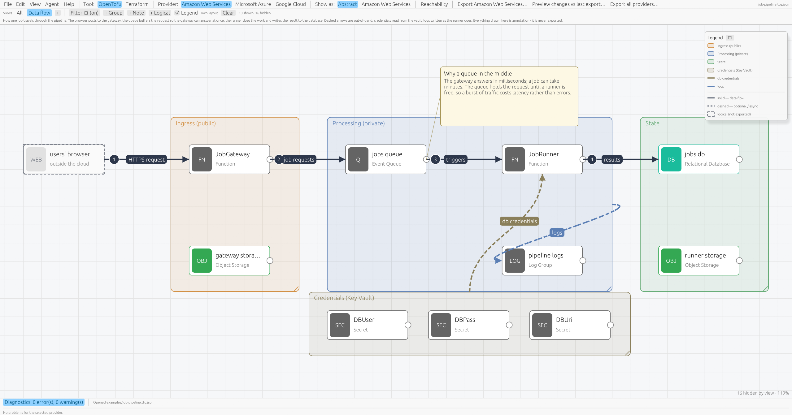

# TerraTofu GUI

A native desktop application, written in Rust, for drawing cloud architecture on a
canvas — resources as nodes, relationships as edges, VPCs / resource groups as
containers — and generating clean, deployable **Terraform** or **OpenTofu** projects from
the diagram.

The diagram is stored as a provider-neutral intermediate representation. Each abstract
resource type is mapped to concrete provider resources by **data files**
(`definitions/*.toml`), so adding cloud coverage means contributing a TOML file, not
writing Rust. "Export for all providers" produces one complete, independent project per
provider — never a single "portable" HCL file, because no such thing can exist.


Status: **Phase 3** — 34 curated abstract types mapped for AWS, Azure and Google Cloud,
plus every native provider resource through the bundled schema index (see "Beyond the
curated catalog"). Curated: networking (Virtual Network, Subnet, Internet Gateway, NAT
Gateway, Route Table, Security Group, Private Endpoint, Network Peering), compute (Compute Instance,
Autoscaling Group, Load Balancer), data (Relational Database, NoSQL Table, Cache, Object
Storage), serverless (Function, Event Queue, Topic, the Azure-only Storage Queue and
Service Bus Namespace), containers (Container App, Container Registry, Kubernetes Cluster,
Kubernetes Node Pool, Kubernetes Workload), DNS (Zone, Record), secrets (Key Vault,
Secret, Encryption Key), monitoring (Log Group, Alarm), IAM Role and the Resource Group container. A
Kubernetes Workload turns its links into EKS Pod Identity, an AKS federated credential or
a GKE workload-identity binding plus a least-privilege policy, the way a Function does.
Gaps a provider cannot
express (an Azure database's network access, for example) are reported as manual steps,
never papered over. Every example passes `tofu validate` for all three providers and
both tools in CI.

Security posture is part of the curated vocabulary rather than something to bolt on
afterwards: buckets block public access and refuse plain HTTP by default, expire objects
and unfinished uploads, and can log access to a second bucket; databases encrypt their
storage, keep backups and take a final snapshot before a destroy; queues, secrets, log
groups and topics can all be linked to an **Encryption Key** with the *Encrypted with*
relation, which becomes a KMS key with a usable key policy on AWS, a Key Vault key on
Azure and a KMS key ring on Google Cloud. Project-wide **default tags** (Settings ▸
Default tags) reach every resource as AWS `default_tags`, Google `default_labels` or an
Azure `tags` argument. See `examples/hardened.ttg.json`.

Google Cloud (added 2026-09-09, `hashicorp/google` 6.x): networks and subnets, Cloud NAT,
firewall rules driven by network tags, Compute Engine, service accounts, Cloud Storage,
Cloud SQL with private services access, Cloud Functions (2nd gen) with Pub/Sub triggers
and a Serverless VPC Access connector, Pub/Sub queues and topics, Secret Manager, Cloud
Logging buckets, Cloud DNS, Memorystore, Firestore, Artifact Registry, GKE, managed
instance groups with an autoscaler, a passthrough Network Load Balancer, Cloud Run and
Cloud Monitoring alert policies. Internet gateways, route tables and private endpoints
are *logical* on GCP (the network already routes to the internet, Cloud NAT covers whole
subnets, and Private Google Access is on every subnet); Storage Queue and Service Bus
Namespace stay Azure-only. The switch to a third provider was pure data plus one
registration line, as Phase 3 promised; see `docs/PHASE2_PLAN.md`.



## Build & run

Requires Rust 1.88 or newer.

```bash
cargo run -p ttg-app --release -- examples/three-tier.ttg.json
```

Headless export (also used in CI):

```bash
cargo run -p ttg-cli -- export-all examples/three-tier.ttg.json --out ./out --zip
```

`terraform` / `tofu` are optional: if one is installed, the app and `ttg export --validate`
run `init -backend=false && validate` on the output for you. The binary is looked up on
`PATH`, in `TTG_TOOL_DIR` if set, and in the usual per-user install folders
(`%LOCALAPPDATA%\Programs\OpenTofu`, `~/.local/bin`, Homebrew, Chocolatey, winget).
Provider plugins downloaded during `init` are cached once per user
(`TF_PLUGIN_CACHE_DIR`, defaulting to `%LOCALAPPDATA%\terratofu-gui\plugin-cache` or
`~/.cache/terratofu-gui/plugin-cache`), so repeated validation is fast.

Full validation of every example against every provider (AWS, Azure, Google Cloud) and
both tools:

```bash
TTG_REQUIRE_VALIDATE=1 cargo test -p ttg-codegen --test validate_examples
```

The same test runs in CI ([.github/workflows/ci.yml](.github/workflows/ci.yml)) with
OpenTofu installed, so a definition change that produces invalid HCL fails the build.

## Using the app

- **Palette** (left): drag a resource onto the canvas, or click to add it at the centre.
- **Canvas**: scroll to pan, Ctrl+scroll to zoom, right-drag / middle-drag to pan, drag on
  empty space for marquee selection. Drag a node into a container to put it inside.
  Drag from the small circle on a node's right edge onto another node to connect them.
- **Inspector** (right): typed fields from the resource definition, provider-specific
  fields, links, and the diagnostics for that node.
- **Toolbar**: choose Terraform or OpenTofu, the target provider, and export.
  *Preview changes vs last export…* (also in the File menu and the Export window) runs
  the generator without writing anything and shows a per-file diff against the folder
  of the last export, changed files expanded and unchanged runs folded, so you can see
  what a re-export would touch. Headless: `ttg diff <project> --out <dir> [--full]`,
  which exits 1 when something would change.
- Badges on nodes: red `!` = error (export blocked), orange `!` = warning (manual step),
  `✕` = no mapping for this provider, blue `M` = flagged external/manual.
- Undo/redo (Ctrl+Z / Ctrl+Y), copy/paste (Ctrl+C / Ctrl+V), delete, select all, save
  (Ctrl+S), zoom to fit (Ctrl+0).
- **File ▸ Open recent** remembers the last ten projects. New, Open and Quit (and the
  window close button) ask before discarding unsaved changes.
- **View ▸ Edge style** switches between curved and orthogonal links. Links attach to
  whichever side faces the other node and fan out when several share a side. Select a
  link to pin either end to a chosen side and position (inspector ▸ Routing). With
  *Route around nodes* on (the default for orthogonal links), a link that would cut
  through another node takes a Z- or U-shaped detour just outside it instead; turn it
  off for the plain facing-sides router.
- A link to a container ends in a small terminal on the nearest wall, wherever the
  other end sits, so a node inside a subnet linking to its VNet stays a short line.
- A link that containment already implies (a subnet drawn inside its network) is not
  drawn and is reported as an info diagnostic; the canvas refuses to create new ones.
- Drag the bottom-right corner of a node or container to resize it; the inspector has
  exact width/height fields and a reset for nodes.
- **Edit ▸ Arrange**: *Tidy layout* (Ctrl+L, also on the canvas and container context
  menus) lays the diagram out in columns, sources on the left and what they depend on
  to the right, recursively inside every container, and fits containers to their
  contents. Align left/centre/right/top/middle/bottom needs two or more selected
  items; distribute horizontally/vertically needs three. All undoable. The same layout
  is available headless with `ttg tidy <project> [--out <file>]`.
- In the inspector, an abstract field that the selected provider's mapping does not use
  is greyed out; its tooltip says which providers do use it.
- **Views** (bar above the canvas) turn the wired diagram into architecture maps that
  explain themselves. The *All* tab is the truth that gets exported; each view is a tab
  stored in the project file with four things of its own:
  - a **filter**: which resources and link kinds are shown — category, link kind, focus
    on the selection within N hops, hide / show-only the selection, *Show containers* to
    drop networks and resource groups from a map, a name glob (`jobs*`, `db-?`), one or
    more provider layers, curated-vs-native origin, a list of resource types, and *Hide
    structural links* so a data-flow view shows only its own arrows (the menu stays open
    until you click outside it). Containers of anything visible stay visible, and the
    filter saves into the active view as you change it;
  - its **own layout**: moving or resizing anything while the view is active changes
    only that view, so a "network" view can cluster subnets one way and a "data" view
    can line the pipeline up another. In a view with its own layout a container is drawn
    as the box its visible members need, so moving a resource takes its network with it
    and a network whose members are all hidden is not drawn at all. Right-click the tab
    and untick *Own layout* to share the All layout instead;
  - **annotations**, none of which are ever exported or become dependencies:
    - `+ Group` adds a draw.io-style grouping box (label, colour; drag its title and
      everything inside follows, and a box drawn inside another nests). Membership is
      geometric — whatever sits in the box is in the group, including after you move it.
    - Right-click a resource, group or logical node and choose *Data flow from here*,
      then click the target, for a labelled arrow. A flow can carry a **step number**
      (drawn as a badge where it starts) and a colour, and labels stagger along the
      arrows when several flows share an endpoint.
    - `+ Note` adds a note box with a title and wrapped body. Pin it to a resource,
      group, flow or logical node in the inspector and it is drawn beside that thing,
      with a leader line, and travels with it.
    - `+ Logical` adds an annotation-only node — a browser, a telephony platform, one
      workload inside a cluster — drawn dashed and muted. Nothing is generated for it,
      but flows can start and end there, so eleven arrows need not converge on one box.
  - a **description and legend**: right-click the tab ▸ *Rename / describe…* writes a
    paragraph shown under the view bar (and at the top of the view's export); the
    *Legend* tick box shows what the group colours, flow colours and line styles mean,
    and is remembered with the view.
  Hidden resources are still exported; the corner label says how many are hidden.
  A view can also be written out as a document:
  `ttg view export <project> "Data flow" --format md|mermaid` gives the description, the
  groups with their members, the flows in step order and the notes, or a Mermaid
  `flowchart LR`; `ttg view list <project>` names them. For a picture, take a screenshot
  with the canvas fitted and the panels hidden (the agent tool does both). The
  job-pipeline example ships a "Data flow" view built this way:


- **Provider layers.** One diagram serves both providers. Anything not tagged is part of
  every provider's export; tick the *Providers* checkboxes on a resource or link to make
  it AWS-only or Azure-only, and provider-only types (Storage Queue, Service Bus
  Namespace) tag themselves. In concrete mode, things that are not part of the shown
  provider's design are dimmed; every provider-specific item carries an "Azure only"
  style tag in both modes. The project inspector lists what each provider's export
  leaves out, and the diagnostics panel reports the same per item, so the two designs
  can differ only where you can see it. A provider-only *container* (a Service Bus
  Namespace on AWS) is just grouping there: its contents are exported as if they sat in
  the enclosing container.
- **Show as: Abstract / \<provider\>** (toolbar, or `P`). In concrete mode every node is
  labelled with the resource it generates for the target provider (`aws_sqs_queue +1`
  means one helper resource; hover for the full list), logical mappings are greyed, the
  palette shows concrete names, and the inspector only offers that provider's fields.
  Drop PNGs into `definitions/icons/<provider>/<type_id>.png` to replace the glyphs with
  an icon pack of your choice (none is shipped: the official icon sets carry their own
  licences).
- **Reachability overlay** (toolbar button or `R`). With a resource that initiates
  traffic selected (function, instance, cluster), the canvas shows what it can reach:
  its way out of the network drawn once through subnet, route table, NAT and internet
  gateway, in-network paths drawn through the security group that admits them, arrows in
  the direction of traffic, targets tinted green (reachable), red (blocked, hover for
  why) or amber (undecidable). With a passive resource selected (database, queue, cache)
  it shows who can reach *it*. Every networked resource carries a tag with the port it
  listens on. With nothing selected it shows the network posture: an orange ring and
  inbound arrow on anything exposed to the internet, a dot for resources with or without
  an outbound path. The inspector lists "Can reach" / "Reached by" with a *path* button
  that filters the canvas to just that path. Paths follow the network fabric: across a
  Network Peering (on AWS only once both sides' route tables are linked to it), over a
  Private Endpoint in the source's network (no NAT needed), and through a Load Balancer
  when the target only admits the balancer's group. The same analysis is available
  headless with `ttg reach <project> --from <name>`; `examples/hub-spoke.ttg.json` shows
  all three.


## Beyond the curated catalog: every provider resource and argument

The curated types are the *portable* part of the catalog. For full provider scope the app
bundles a compact index of the real provider schemas (every resource, argument and nested
block of the AWS and Azure providers the catalog pins, about half a megabyte compressed)
and uses it in three ways:

- **Advanced arguments on curated resources.** Every provider mapping section in the
  inspector has an *Advanced arguments* editor: search any argument the provider
  accepts, add it, and it is merged into the generated block (an argument the mapping
  already sets is overridden by yours, with a note). Typed editors for strings, numbers
  and booleans; JSON for lists, maps and nested blocks; a *ref* button to point a string
  at another resource's attribute. Unknown names, read-only attributes and type
  mismatches are errors before validate ever runs.
- **Native provider resources.** Type two or more letters in the palette search and a
  *native* section lists matching resources from the schema: all 1,500+ AWS and 1,100+
  Azure types. Drop one on the canvas and its inspector is generated from the schema,
  with required arguments flagged. Native resources are provider-only by nature, so they
  tag themselves to that provider's layer and the other provider's export leaves them
  out. Link them to other resources with *Depends on* and reference attributes with the
  ref button (`{"$ref": {"entity": "assets", "attr": "id"}}` in the file), or use
  `{"$raw": "<hcl>"}` for an expression.
- **A test that keeps curated definitions honest.** Every resource type and argument a
  curated mapping writes is checked against the schema in CI, so a provider rename fails
  a test instead of a user's export.

`ttg schema info` shows the index in use, `ttg schema search aws "sqs queue"` and
`ttg schema show azure azurerm_storage_queue` explore it (add `--depth N` /
`--required-only` to narrow a large resource - `aws_wafv2_web_acl` alone is ~900 KB
unfiltered), and `ttg schema refresh` regenerates it from the installed tool into your
data directory, where it takes precedence over the bundled copy (`--out
crates/ttg-schema/data/index.json.gz` refreshes the bundled one). See
`examples/native-extras.ttg.json`.


## Driving the app from an agent (MCP)

The app can host a [Model Context Protocol](https://modelcontextprotocol.io) server so
Claude Code (or any MCP client) can read and edit the diagram you have open, and you
watch it happen. It is off until you switch it on:

1. **Agent ▸ MCP server** (or *Agent ▸ Settings & activity…*). Nothing runs while it is
   off; switching it on starts a small HTTP server on `127.0.0.1:9337` (port and token
   are in the settings window, "start with the app" is a checkbox, off by default).
2. Copy the command from the settings window and run it once:

   ```bash
   claude mcp add --transport http terratofu http://127.0.0.1:9337/mcp --header "Authorization: Bearer <token>"
   ```

3. Ask Claude Code to look at or change the diagram. Every change is one undo step,
   flashes orange on the canvas, and is logged in the settings window; the status bar
   shows what the agent did. Saving to disk only happens when a tool is explicitly asked
   to, and opening another file goes through the same unsaved-changes prompt as the menu.

The 46 tools cover reading (project, catalog, diagnostics, reachability, export preview,
export diff, `view_get`, `view_export`, screenshot) and editing (add/update/move/resize/
reparent/delete entities, links, selection, views, tidy/align/distribute, settings,
save/open/new, export with optional validate, undo/redo). An agent documents a view the
way you would: `view_group_add`, `view_flow_add` (with `step` and `color`),
`view_note_add`, `view_logical_add` and `view_annotation_remove` all take an optional
`view`, so a whole map can be drawn in one `project_apply` without switching tabs, and
`view_fit` plus `screenshot { view, fit, hide_panels }` let it look at what it drew.
`project_apply` runs a list of diagram writes as **one**
undo step and rolls all of them back if any fails; `project_changes` (or a subscription
to the `ttg://project` resource) tells the agent when *you* changed something. The
project, its summary, diagnostics, the catalog and the docs are also exposed as MCP
resources (`ttg://project`, `ttg://catalog/<type>`, `ttg://docs/mapping-format`, …).
In *Agent ▸ Settings & activity* you choose which actions must be approved first: by
default saving, opening, starting a new project and writing an export pop an
Allow / Deny prompt; deleting entities or links can be added (removing an annotation
never needs approval - groups and flows are never exported). A prompt does not stall the
agent: reads keep answering while one is open, and further writes queue up behind it in
order rather than jumping ahead. Only localhost can connect and every request needs the
bearer token. `terratofu-gui --serve --port N --token T [project]` runs the same server
without a window (no screenshots, no prompts) for CI and scripted editing; the headless
integration test in `crates/ttg-app/tests` drives it that way. The feature is the `mcp`
cargo feature of `ttg-app` (on by default; build with `--no-default-features` to leave it
out). Windows note: ports in the 6xxx-7xxx block are often reserved by Hyper-V, which is
why the default is 9337.


## Contributing

[CONTRIBUTING.md](CONTRIBUTING.md) walks through adding a resource definition (start from
`ttg catalog --example <type_id>`, verify argument names with `ttg schema show`, prove it
with an example) and what CI checks. `ttg catalog --strict` reports dead abstract fields,
outputs that name attributes the provider does not have and relations no mapping
consumes; `schemas/project.schema.json` (`ttg schema project`) describes the project
file for editors and external tools, and a test keeps it current. Release builds are not
automated yet; [docs/RELEASING.md](docs/RELEASING.md) explains how to set them up with
GitHub Actions.

## Repository layout

```
definitions/          resource + provider mapping files (data, contributable)
crates/ttg-core       IR, project file, structural validation, dependency graph
crates/ttg-catalog    loads and validates definitions
crates/ttg-codegen    HCL generation, diagnostics, MANUAL_STEPS.md, tool toggle
crates/ttg-cli        headless `ttg` command
crates/ttg-app        egui/eframe desktop application
examples/             sample projects (every one exports and validates on every provider)
schemas/              JSON Schema of the .ttg.json project file (generated: `ttg schema project`)
docs/                 ARCHITECTURE.md, MAPPING_FORMAT.md, PHASE2_PLAN.md, MCP_PLAN.md, RELEASING.md
CONTRIBUTING.md       how to add a definition, verify it, and what CI expects
```

Read [docs/ARCHITECTURE.md](docs/ARCHITECTURE.md) for the design and
[docs/MAPPING_FORMAT.md](docs/MAPPING_FORMAT.md) to contribute a resource definition.

## Licence

Dual-licensed under MIT or Apache-2.0, at your option. Mapping definitions are written
from publicly documented provider schemas (the OpenTofu registry is the canonical
reference); no HashiCorp source code is used.
