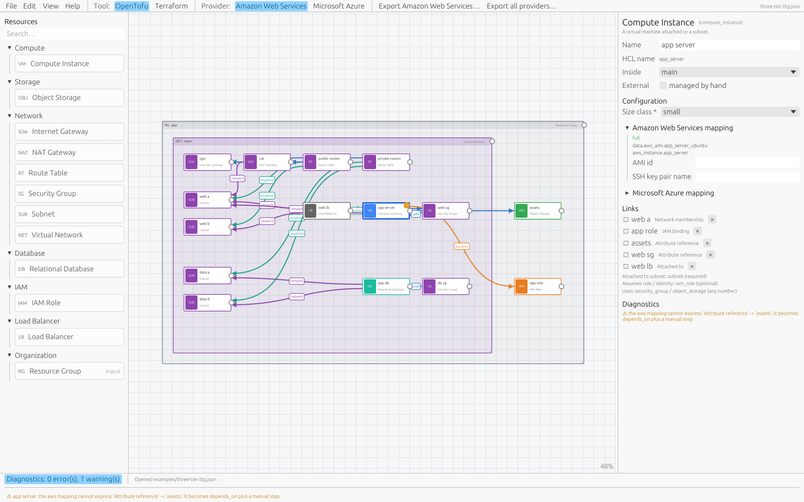
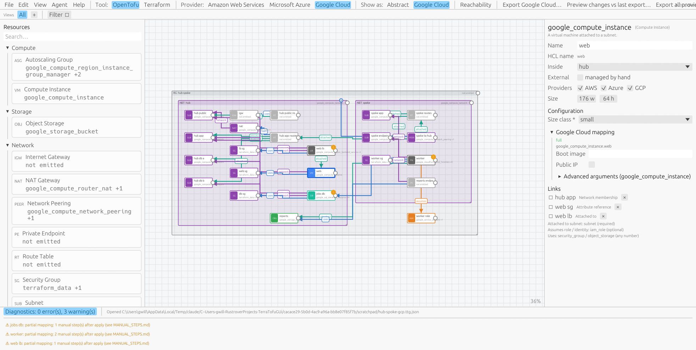
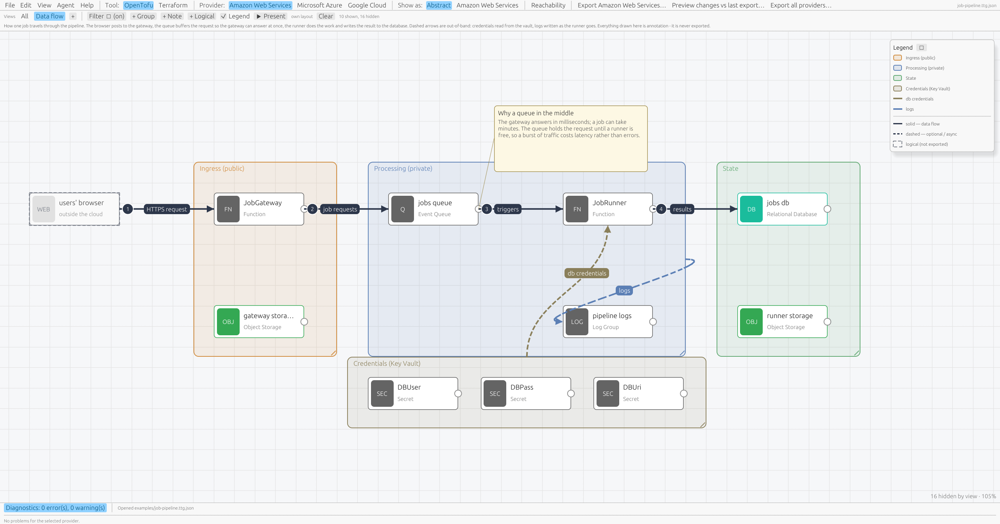
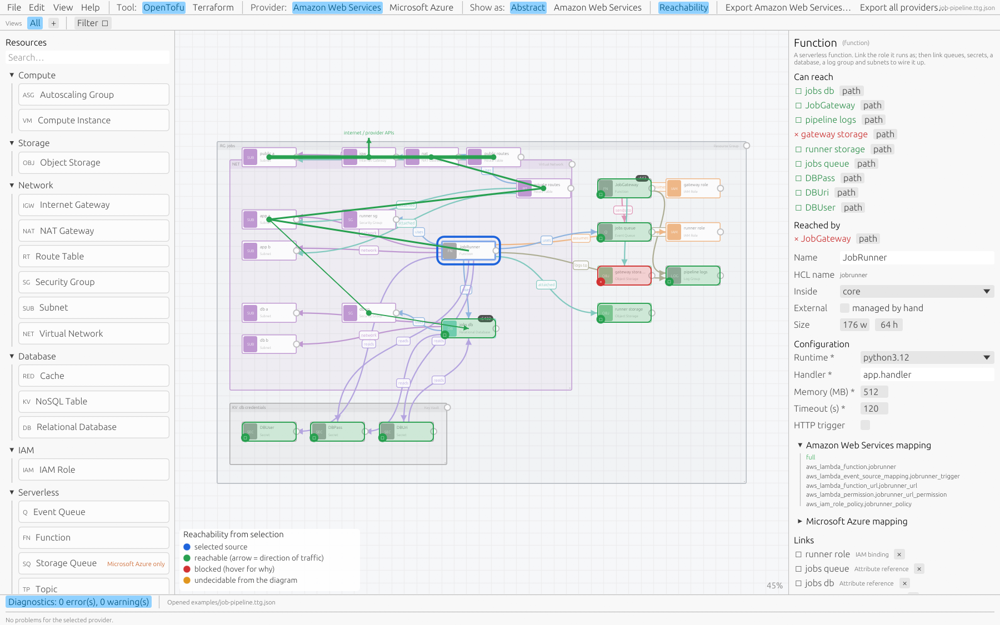
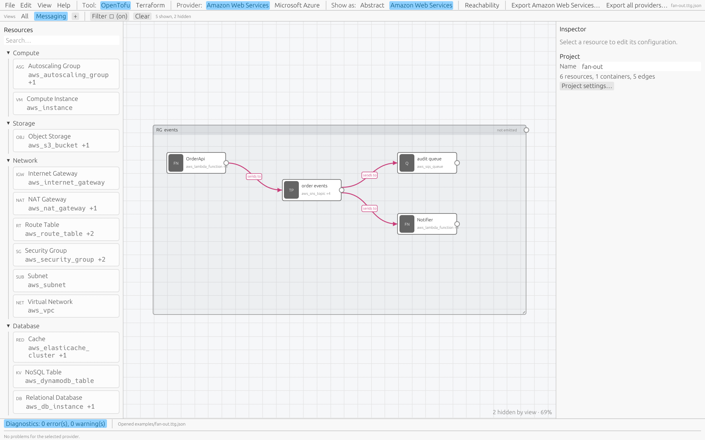
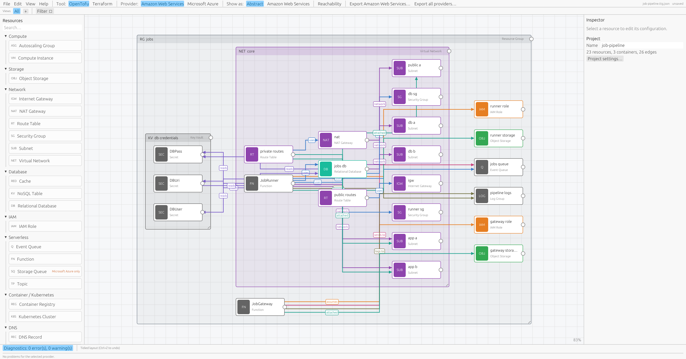
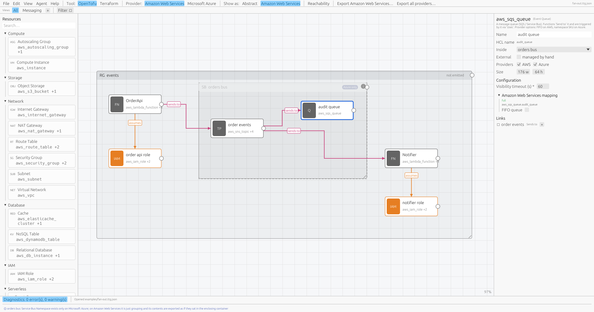
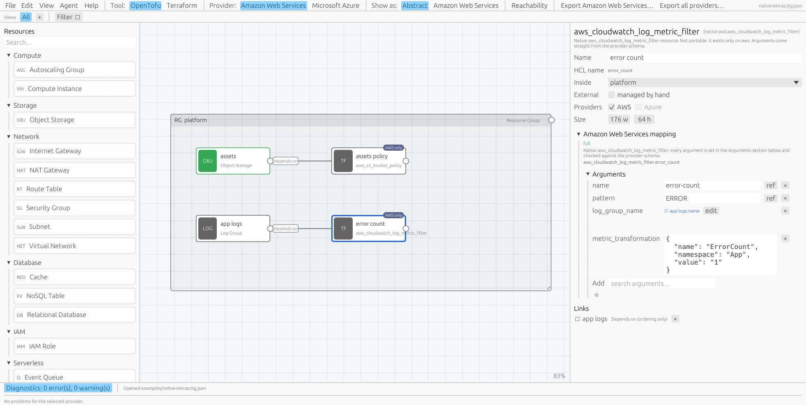
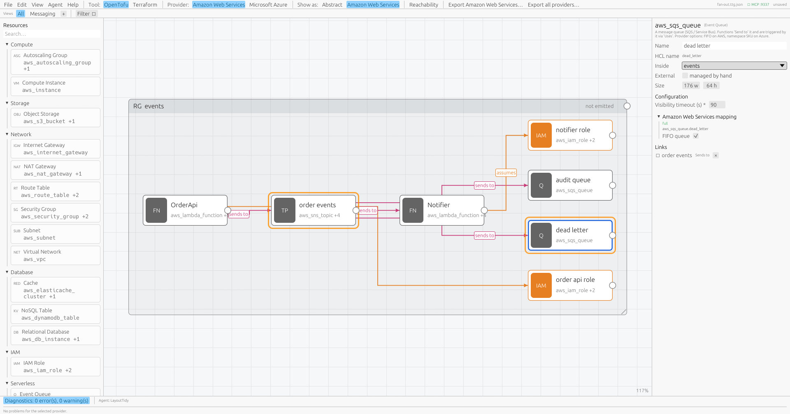

# TerraTofu GUI

A native desktop application, written in Rust, for drawing cloud architecture on a
canvas — resources as nodes, relationships as edges, VPCs / resource groups as
containers — and generating clean, deployable **Terraform** or **OpenTofu** projects from
the diagram.

The diagram is stored as a provider-neutral intermediate representation. Each abstract
resource type is mapped to concrete provider resources by **data files**
(`definitions/*.toml`), so adding cloud coverage means contributing a TOML file, not
writing Rust. "Export for all providers" produces one complete, independent project per
provider — never a single "portable" HCL file, because no such thing can exist.



Status: **Phase 3** — 43 curated abstract types mapped for AWS, Azure and Google Cloud,
plus every native provider resource through the bundled schema index (see "Beyond the
curated catalog"). Curated: networking (Virtual Network, Subnet, Internet Gateway, NAT
Gateway, Route Table, Security Group, Private Endpoint, Network Peering), the internet-facing
edge (Load Balancer with HTTPS, TLS Certificate, Web Application Firewall, CDN), compute
(Compute Instance, Autoscaling Group), data (Relational Database, NoSQL Table, Cache, Object
Storage, File System), serverless (Function, Event Queue, Topic, the Azure-only Storage Queue and
Service Bus Namespace), containers (Container Environment, Container App, Container Job,
Container Registry, Kubernetes Cluster, Kubernetes Node Pool, Kubernetes Workload), DNS
(Zone, Record), secrets (Key Vault,
Secret, Encryption Key), monitoring (Log Group, Alarm, Budget, Audit Trail), IAM Role, User Identity and the Resource Group container. A
Kubernetes Workload turns its links into EKS Pod Identity, an AKS federated credential or
a GKE workload-identity binding plus a least-privilege policy, the way a Function does.
Container Apps and Jobs drawn inside a **Container Environment** share one ECS cluster /
Container Apps environment and carry their configuration to every provider: environment
variables, secrets injected from a linked Secret (one JSON key per variable on AWS), the
health check, the stop timeout, the CPU architecture and an image from a linked registry.
Separate task and execution roles, a load balancer forwarding to an app (by IP on AWS,
through a serverless NEG on Google Cloud), background workers with no ingress and one-shot
jobs (an ECS task definition, a Container Apps job, a Cloud Run job) are all part of it.
Gaps a provider cannot
express (an Azure database's network access, for example) are reported as manual steps,
never papered over. Every example passes `tofu validate` for all three providers and
both tools in CI.

The edge is built for applications as well as files: a **CDN** can be a dynamic site
(every method, nothing cached by default) with path behaviours that pick AWS managed cache
and origin-request policies, origin timeouts, origin headers and a generated secret header
the load balancer insists on. A load-balancer origin is reached by a DNS name its
certificate covers (or the export says how to add one), a **Web Application Firewall**
carries per-path rate rules and builds only the Web ACL scopes something links to, DNS
Records include AAAA, and on Azure the CDN is Front Door Standard/Premium with its WAF
policy attached. See `examples/edge-dynamic.ttg.json`.

Day-two operations are part of the vocabulary too: a queue can **dead-letter** into
another one (an SQS redrive policy, Service Bus forwarding inside a namespace, a Pub/Sub
dead-letter policy with the IAM the service agent needs); an **Alarm** picks its metric
from a portable preset (queue depth, dead letters, 5xx count or rate, unhealthy targets,
free storage as a percentage, …), a statistic (percentiles included) and a decimal
threshold in the unit the inspector shows beside it, carries the dimensions the cloud
publishes the metric with (a target-health alarm names the target group as well as the
load balancer), and refuses a preset the watched resource has no metric for rather than
guessing; a **Virtual Network**
can turn on flow logs; a **Container Registry** can hold several repositories; a **Topic**
can subscribe a mailbox or a webhook, or receive a **Budget**'s threshold alert instead of
(or alongside) an email; and **Budget** and **Audit Trail** put the monthly spend alert
and the account's activity record on the canvas. See
`examples/operations.ttg.json`.

Security posture is part of the curated vocabulary rather than something to bolt on
afterwards: buckets block public access and refuse plain HTTP by default, expire objects
and unfinished uploads, can log access to a second bucket, and restrict which HTTP
methods a CORS rule answers (GET/HEAD by default, extendable to PUT for a pre-signed
browser upload); databases encrypt their
storage, keep backups and take a final snapshot before a destroy, take free-form storage
that can grow by itself up to a limit, carry server parameters, and on AWS can leave the
master password to RDS (no password in the configuration or the state; workloads read the
secret RDS keeps); a **Secret** can be created without a value, which is then set outside
OpenTofu and never reaches the state; queues, secrets, log
groups and topics can all be linked to an **Encryption Key** with the *Encrypted with*
relation, which becomes a KMS key with a usable key policy on AWS, a Key Vault key on
Azure and a KMS key ring on Google Cloud. Project-wide **default tags** (Settings ▸
Default tags) reach every resource as AWS `default_tags`, Google `default_labels` or an
Azure `tags` argument. See `examples/hardened.ttg.json`.

Where the state lives is a project setting too (Settings ▸ State backend, or
`settings_set { backend }` over MCP): an S3 bucket with S3 lock files, an Azure storage
container or a GCS bucket. The export then carries the `backend` block in `versions.tf`
and a small `bootstrap/` configuration that creates the versioned, private,
TLS-only bucket first. With OpenTofu, **state encryption** adds an `encryption {}` block —
AWS KMS or Cloud KMS with the Encryption Key you choose (the bootstrap root creates it, since
the key must exist before the state it encrypts), a passphrase on Azure — and Terraform,
which cannot encrypt state, gets a warning instead. A generated secret in local or
unencrypted state is flagged. Arguments a provider refuses together when it plans —
`password` with `manage_master_user_password`, `statistic` with `extended_statistic`,
`name` with `name_prefix` — are an error before export, whether the mapping or an extra
argument set them, because `validate` cannot see the clash while one side is a variable.
Provider versions can be pinned per project (Settings ▸
Provider versions); the defaults are `aws ~> 6.0`, `azurerm ~> 4.0` and `google ~> 7.0`.

Google Cloud (added 2026-09-09, `hashicorp/google` 7.x since round 3): networks and subnets, Cloud NAT,
firewall rules driven by network tags, Compute Engine, service accounts, Cloud Storage,
Cloud SQL with private services access, Cloud Functions (2nd gen) with Pub/Sub triggers
and a Serverless VPC Access connector, Pub/Sub queues and topics, Secret Manager, Cloud
Logging buckets, Cloud DNS, Memorystore, Firestore, Artifact Registry, GKE, managed
instance groups with an autoscaler, a passthrough Network Load Balancer, Cloud Run and
Cloud Monitoring alert policies. Internet gateways, route tables and private endpoints
are *logical* on GCP (the network already routes to the internet, Cloud NAT covers whole
subnets, and Private Google Access is on every subnet); Storage Queue and Service Bus
Namespace stay Azure-only. The switch to a third provider was pure data plus one
registration line, as Phase 3 promised; see `docs/PHASE2_PLAN.md`.



## Build & run

Requires Rust 1.88 or newer.

```bash
cargo run -p ttg-app --release -- examples/three-tier.ttg.json
```

Headless export (also used in CI):

```bash
cargo run -p ttg-cli -- export-all examples/three-tier.ttg.json --out ./out --zip
```

`terraform` / `tofu` are optional: if one is installed, the app and `ttg export --validate`
run `init -backend=false && validate` on the output for you. The binary is looked up on
`PATH`, in `TTG_TOOL_DIR` if set, and in the usual per-user install folders
(`%LOCALAPPDATA%\Programs\OpenTofu`, `~/.local/bin`, Homebrew, Chocolatey, winget).
Provider plugins downloaded during `init` are cached once per user
(`TF_PLUGIN_CACHE_DIR`, defaulting to `%LOCALAPPDATA%\terratofu-gui\plugin-cache` or
`~/.cache/terratofu-gui/plugin-cache`), so repeated validation is fast.

Full validation of every example against every provider (AWS, Azure, Google Cloud) and
both tools:

```bash
TTG_REQUIRE_VALIDATE=1 cargo test -p ttg-codegen --test validate_examples
```

The same test runs in CI ([.github/workflows/ci.yml](.github/workflows/ci.yml)) with
OpenTofu installed, so a definition change that produces invalid HCL fails the build.

## Using the app

- **Palette** (left): drag a resource onto the canvas, or click to add it at the centre.
- **Canvas**: scroll to pan, Ctrl+scroll to zoom, right-drag / middle-drag to pan, drag on
  empty space for marquee selection. Drag a node into a container to put it inside.
  Drag from the small circle on a node's right edge onto another node to connect them.
- **Inspector** (right): typed fields from the resource definition, provider-specific
  fields, links, and the diagnostics for that node.
- **Toolbar**: choose Terraform or OpenTofu, the target provider, and export.
  *Preview changes vs last export…* (also in the File menu and the Export window) runs
  the generator without writing anything and shows a per-file diff against the folder
  of the last export, changed files expanded and unchanged runs folded, so you can see
  what a re-export would touch. Headless: `ttg diff <project> --out <dir> [--full]`,
  which exits 1 when something would change.
- **Kubernetes manifests** (Settings ▸ Output, `ttg export --k8s`, MCP `export_run { k8s:
  true }`): the export also writes `k8s/`, one file per Kubernetes Workload with its
  ServiceAccount (annotated the way each cloud's workload identity wants), a Deployment
  whose image, environment, volumes, node selector, tolerations and GPU/CPU/memory come
  from the diagram, a Service, a KEDA `ScaledObject` for a queue worker or a CPU
  autoscaler, and on AWS a `TargetGroupBinding` for a workload behind the load balancer.
  Values only known after `apply` (queue URLs, the file system id, the target group ARN)
  are `k8s_*` outputs that `k8s/render.sh` / `render.ps1` substitute into `k8s/rendered/`,
  and the manual steps the manifests replace leave `MANUAL_STEPS.md`.
- Badges on nodes: red `!` = error (export blocked), orange `!` = warning (manual step),
  `✕` = no mapping for this provider, blue `M` = flagged external/manual.
- Undo/redo (Ctrl+Z / Ctrl+Y), copy/paste (Ctrl+C / Ctrl+V), delete, select all, save
  (Ctrl+S), zoom to fit (Ctrl+0).
- **File ▸ Open recent** remembers the last ten projects. New, Open and Quit (and the
  window close button) ask before discarding unsaved changes.
- **View ▸ Edge style** switches between curved and orthogonal links. Links attach to
  whichever side faces the other node and fan out when several share a side. Select a
  link to pin either end to a chosen side and position (inspector ▸ Routing). With
  *Route around nodes* on (the default for orthogonal links), a link that would cut
  through another node takes a Z- or U-shaped detour just outside it instead; turn it
  off for the plain facing-sides router.
- A link to a container ends in a small terminal on the nearest wall, wherever the
  other end sits, so a node inside a subnet linking to its VNet stays a short line.
- A link that containment already implies (a subnet drawn inside its network) is not
  drawn and is reported as an info diagnostic; the canvas refuses to create new ones.
- Drag the bottom-right corner of a node or container to resize it; the inspector has
  exact width/height fields and a reset for nodes.
- **Edit ▸ Arrange**: *Tidy layout* (Ctrl+L, also on the canvas and container context
  menus) lays the diagram out in columns, sources on the left and what they depend on
  to the right, recursively inside every container, and fits containers to their
  contents. Align left/centre/right/top/middle/bottom needs two or more selected
  items; distribute horizontally/vertically needs three. All undoable. The same layout
  is available headless with `ttg tidy <project> [--out <file>]`.
- In the inspector, an abstract field that the selected provider's mapping does not use
  is greyed out; its tooltip says which providers do use it.
- **Views** (bar above the canvas) turn the wired diagram into architecture maps that
  explain themselves. The *All* tab is the truth that gets exported; each view is a tab
  stored in the project file with four things of its own:
  - a **filter**: which resources and link kinds are shown — category, link kind, focus
    on the selection within N hops, hide / show-only the selection, *Show containers* to
    drop networks and resource groups from a map, a name glob (`jobs*`, `db-?`), one or
    more provider layers, curated-vs-native origin, a list of resource types, and *Hide
    structural links* so a data-flow view shows only its own arrows (the menu stays open
    until you click outside it). Containers of anything visible stay visible, and the
    filter saves into the active view as you change it;
  - its **own layout**: moving or resizing anything while the view is active changes
    only that view, so a "network" view can cluster subnets one way and a "data" view
    can line the pipeline up another. In a view with its own layout a container is drawn
    as the box its visible members need, so moving a resource takes its network with it
    and a network whose members are all hidden is not drawn at all. Right-click the tab
    and untick *Own layout* to share the All layout instead;
  - **annotations**, none of which are ever exported or become dependencies:
    - `+ Group` adds a draw.io-style grouping box (label, colour; drag its title and
      everything inside follows, and a box drawn inside another nests). Membership is
      geometric — whatever sits in the box is in the group, including after you move it.
    - Right-click a resource, group or logical node and choose *Data flow from here*,
      then click the target, for a labelled arrow. A flow can carry a **step number**
      (drawn as a badge where it starts) and a colour, and labels stagger along the
      arrows when several flows share an endpoint.
    - `+ Note` adds a note box with a title and wrapped body. Pin it to a resource,
      group, flow or logical node in the inspector and it is drawn beside that thing,
      with a leader line, and travels with it.
    - `+ Logical` adds an annotation-only node — a browser, a telephony platform, one
      workload inside a cluster — drawn dashed and muted. Nothing is generated for it,
      but flows can start and end there, so eleven arrows need not converge on one box.
  - a **description and legend**: right-click the tab ▸ *Rename / describe…* writes a
    paragraph shown under the view bar (and at the top of the view's export); the
    *Legend* tick box shows what the group colours, flow colours and line styles mean,
    and is remembered with the view.
  Hidden resources are still exported; the corner label says how many are hidden.
  The **View** menu's *Active view* tools do the tedious parts:
  - *Generate data flows from links* draws a flow for every link that carries data
    between the resources the view shows — sends to, reads, uses, logs, dead letters,
    calls, mounts, forwards to — in the direction the data moves (a secret is *read by*
    the function, a queue is *consumed by* its worker), never duplicating a pair that
    already has a flow. Network membership, IAM bindings, encryption and containment
    produce nothing. You add the numbering and the prose.
  - *Tidy by flows* lays the view out left to right by its flows and step numbers, each
    grouping box a swimlane of its own, in the view's own layout only; flows fan out
    along the side of a busy node, are routed around nodes when *Route around nodes* is
    on, and a label with no room on its arrow steps off it on a short leader line.
  - *Arrange notes* puts every pinned note back beside what it explains (tidying a view
    does this too), and *zoom to fit* keeps the legend's strip free so nothing is drawn
    under it.
  - *Present steps* (or **▶ Present** on the view bar) steps through the numbered flows
    with ← → or Space: the current step's flows and ends are highlighted, the rest
    faded, and a caption shows the step's labels and any note pinned to those flows.
    Esc leaves.
  - *Build "Where personal data goes"* makes (or refreshes) a view of the resources
    classified *personal* or *payment* and everything their data reaches one link on.
  Every resource also says what it is for: a **classification** (public, internal,
  confidential, personal, payment — a pill on the node and a *Classification* filter), an
  **owner** and a **description**. The owner and description are emitted as `Owner` /
  `Description` tags on AWS and Azure (an `owner` label on Google Cloud) and as a comment
  above the resource's blocks in the generated HCL; a flow can say what **data** travels
  along it ("call audio"), drawn under its label.
  A view can also be written out as a document:
  `ttg view export <project> "Data flow" --format md|mermaid|sequence` gives the
  description, the resources it shows (with classification, description and owner when
  any is set), the groups with their members, the flows in step order and the notes; a
  Mermaid `flowchart LR`; or a Mermaid `sequenceDiagram` of the numbered flows (steps
  sharing a number side by side in a `par` block). `ttg view list <project>` names them.
  For a picture, take a screenshot
  with the canvas fitted and the panels hidden (the agent tool does both). The
  job-pipeline example ships a "Data flow" view built this way:


- **Provider layers.** One diagram serves both providers. Anything not tagged is part of
  every provider's export; tick the *Providers* checkboxes on a resource or link to make
  it AWS-only or Azure-only, and provider-only types (Storage Queue, Service Bus
  Namespace) tag themselves. In concrete mode, things that are not part of the shown
  provider's design are dimmed; every provider-specific item carries an "Azure only"
  style tag in both modes. The project inspector lists what each provider's export
  leaves out, and the diagnostics panel reports the same per item, so the two designs
  can differ only where you can see it. A provider-only *container* (a Service Bus
  Namespace on AWS) is just grouping there: its contents are exported as if they sat in
  the enclosing container.
- **Show as: Abstract / \<provider\>** (toolbar, or `P`). In concrete mode every node is
  labelled with the resource it generates for the target provider (`aws_sqs_queue +1`
  means one helper resource; hover for the full list), logical mappings are greyed, the
  palette shows concrete names, and the inspector only offers that provider's fields.
  Drop PNGs into `definitions/icons/<provider>/<type_id>.png` to replace the glyphs with
  an icon pack of your choice (none is shipped: the official icon sets carry their own
  licences).
- **Reachability overlay** (toolbar button or `R`). With a resource that initiates
  traffic selected (function, instance, cluster), the canvas shows what it can reach:
  its way out of the network drawn once through subnet, route table, NAT and internet
  gateway, in-network paths drawn through the security group that admits them, arrows in
  the direction of traffic, targets tinted green (reachable), red (blocked, hover for
  why) or amber (undecidable). With a passive resource selected (database, queue, cache)
  it shows who can reach *it*. Every networked resource carries a tag with the port it
  listens on. With nothing selected it shows the network posture: an orange ring and
  inbound arrow on anything exposed to the internet, a dot for resources with or without
  an outbound path. The inspector lists "Can reach" / "Reached by" with a *path* button
  that filters the canvas to just that path. Paths follow the network fabric: across a
  Network Peering (on AWS only once both sides' route tables are linked to it), over a
  Private Endpoint in the source's network (no NAT needed), and through a Load Balancer
  when the target only admits the balancer's group. The same analysis is available
  headless with `ttg reach <project> --from <name>`; `examples/hub-spoke.ttg.json` shows
  all three.

- **Cost estimate** (*View ▸ Cost estimate…*, `ttg cost <project>`, or the agent's
  `cost_estimate` tool). A monthly figure per resource, per type and per saved view and
  group, for any provider and its region, from price lists bundled with the app and the
  usage assumptions you set in the window (GB stored per bucket, node-hours a day of a GPU
  pool that scales to zero, requests, log volume — project-wide or per resource, saved
  with the project). A `budget` resource whose limit the estimate exceeds gets a
  warning. **It is an estimate, not a quote:** the prices are on-demand list prices in US
  dollars as of the date shown in the window (no free tier, discounts, reservations,
  support or tax), some items are left out and say why, and usage is whatever you
  assumed. Check the provider's own calculator before committing to a budget; see
  [docs/PRICES.md](docs/PRICES.md) for the sources and how the list is refreshed.









## Beyond the curated catalog: every provider resource and argument

The curated types are the *portable* part of the catalog. For full provider scope the app
bundles a compact index of the real provider schemas (every resource, argument and nested
block of the AWS, Azure and Google Cloud providers the catalog pins, and every data
source, about 1.3 MB compressed) and uses it in these ways:

- **Advanced arguments on curated resources.** Every provider mapping section in the
  inspector has an *Advanced arguments* editor: search any argument the provider
  accepts, add it, and it is merged into the generated block (an argument the mapping
  already sets is overridden by yours, with a note). Typed editors for strings, numbers
  and booleans; JSON for lists, maps and nested blocks; a *ref* button to point a string
  at another resource's attribute. Unknown names, read-only attributes and type
  mismatches are errors before validate ever runs.
- **Native provider resources.** Type two or more letters in the palette search and a
  *native* section lists matching resources from the schema: all 1,500+ AWS and 1,100+
  Azure types. Drop one on the canvas and its inspector is generated from the schema,
  with required arguments flagged. Native resources are provider-only by nature, so they
  tag themselves to that provider's layer and the other provider's export leaves them
  out. Link them to other resources with *Depends on* and reference attributes with the
  ref button (`{"$ref": {"entity": "assets", "attr": "id"}}` in the file; `"block"` and,
  for a repeated block such as one ECR repository of several, `"key": "worker"` pick
  which block), or use `{"$raw": "<hcl>"}` for an expression (`"refs"` splices `$ref`s
  into it at `@name@`). A value of `null` on an argument the mapping sets leaves it out
  of the block (∅ in the editor).
- **Native data sources.** The same search lists every data source
  (`native:aws:data.aws_ec2_managed_prefix_list`): a lookup of something that already
  exists, drawn with a dashed outline and a *data* badge, emitted as `data "<type>"
  "<name>"` and referenced like any resource. A Security Group rule row can also name an
  AWS-managed prefix list directly (`prefix_list =
  "com.amazonaws.global.cloudfront.origin-facing"`) and the export looks it up itself.
- **References the graph can see.** Every `$ref` and every address inside a `$raw` is
  checked against what the export generates. One it generates is a link — drawn as a
  dashed arrow, and enough to clear "nothing links to this" — and one it does not (a
  resource since flagged external or deleted, a typo, a `local.*`) is an error naming the
  argument and the address, before `validate` would fail.
- **A test that keeps curated definitions honest.** Every resource type and argument a
  curated mapping writes is checked against the schema in CI, so a provider rename fails
  a test instead of a user's export.

`ttg schema info` shows the index in use, `ttg schema search aws "sqs queue"` and
`ttg schema show azure azurerm_storage_queue` explore it (add `--depth N` /
`--required-only` to narrow a large resource - `aws_wafv2_web_acl` alone is ~900 KB
unfiltered; `ttg schema search aws prefix_list --kind data` and `ttg schema show aws
data.aws_ec2_managed_prefix_list` for data sources), and `ttg schema refresh`
regenerates it from the installed tool into your
data directory, where it takes precedence over the bundled copy (`--out
crates/ttg-schema/data/index.json.gz` refreshes the bundled one). See
`examples/native-extras.ttg.json`.



**What an export looks like.** Every file is already formatted the way `tofu fmt` /
`terraform fmt` formats it. Resources made once per list entry or per linked resource
are named after the entry (`aws_ecr_repository.images_repo_worker`), not its position,
so reordering a list replaces nothing; `moved.tf` carries an existing state over from
the old index-based names on its next apply. The export ships no
`.terraform.lock.hcl`: lock for every platform before committing (`tofu providers lock
-platform=linux_amd64 -platform=linux_arm64 -platform=darwin_arm64
-platform=windows_amd64`, which `ttg export --lock` runs for you); its README says the
same.

## Driving the app from an agent (MCP)

The app can host a [Model Context Protocol](https://modelcontextprotocol.io) server so
Claude Code (or any MCP client) can read and edit the diagram you have open, and you
watch it happen. It is off until you switch it on:

1. **Agent ▸ MCP server** (or *Agent ▸ Settings & activity…*). Nothing runs while it is
   off; switching it on starts a small HTTP server on `127.0.0.1:9337` (port and token
   are in the settings window, "start with the app" is a checkbox, off by default).
2. Copy the command from the settings window and run it once:

   ```bash
   claude mcp add --transport http terratofu http://127.0.0.1:9337/mcp --header "Authorization: Bearer <token>"
   ```

3. Ask Claude Code to look at or change the diagram. Every change is one undo step,
   flashes orange on the canvas, and is logged in the settings window; the status bar
   shows what the agent did. Saving to disk only happens when a tool is explicitly asked
   to, and opening another file goes through the same unsaved-changes prompt as the menu.

The 54 tools cover reading (project, catalog, catalog relations, diagnostics,
reachability, export preview, one entity's HCL with `entity_preview`, export diff,
`view_get`, `view_export`, screenshot, `approval_status`) and editing (add/update/move/resize/
reparent/delete entities, links, selection, views, tidy/align/distribute, settings,
save/open/new, `project_import` of a `.ttg.json` given as JSON, export with optional
validate, undo/redo). An agent documents a view the
way you would: `view_group_add`, `view_flow_add` (with `step` and `color`),
`view_note_add`, `view_logical_add` and `view_annotation_remove` all take an optional
`view`, so a whole map can be drawn in one `project_apply` without switching tabs, and
`entity_move` / `entity_resize` arrange the annotations as well as the resources. Views
themselves are editable: `view_save { replace }` rewrites a saved filter without
disturbing the drawing on it, `view_update { filter }` does the same by name, and
`view_delete` removes one. `view_fit` plus `screenshot { view, fit, hide_panels, width,
height }` let it look at what it drew — the window is resized for the capture and put
back, so a big view is readable however small the window was. `view_generate { kind:
"data_flow" }` derives a view's flows from the links and `{ kind: "personal_data" }`
builds "Where personal data goes"; `layout_tidy { view, by: "flows" }` lays a view out by
its flows and `view_arrange_notes` puts its notes back beside their anchors;
`view_export { format: "sequence" }` gives the steps as a sequence diagram; and
`entity_update` (one entity or a `select`) takes `classification`, `description` and
`owner`.
Reads can be narrowed (`diagnostics { entity, severity, provider }`, `project_get { fields,
entities }`) and writes widened: `entity_update` and `link_add` take a `select` (`types`,
`name_glob`, `ids`) to change or link many entities as one undo step. `serverInfo` and the
instructions quote the TerraTofu version and a catalog hash, so a client knows when to
refresh its cached tool list. `project_apply` runs a list of diagram writes as **one**
undo step and rolls all of them back if any fails (with `dry_run: true` it plays the batch,
reports which diagnostics it would add or clear, and keeps nothing); `project_changes` (or a subscription
to the `ttg://project` resource) tells the agent when *you* changed something. The
project, its summary, diagnostics, the catalog and the docs are also exposed as MCP
resources (`ttg://project`, `ttg://catalog/<type>`, `ttg://docs/mapping-format`, …).
In *Agent ▸ Settings & activity* you choose which actions must be approved first: by
default saving, opening, starting a new project and writing an export pop an
Allow / Deny prompt; deleting entities or links can be added (removing an annotation
never needs approval - groups and flows are never exported). Such a call does not wait
for you: it answers within seconds with `{status: "pending_approval", ticket, what,
applied: false}`, the agent tells you and polls `approval_status { ticket }`, and the
write runs only when you press Allow (the ticket then says `applied`, with the result,
or `denied`, `failed`, or `expired` if nobody answered within the time set in the
settings, ten minutes by default). Everything else keeps working while a prompt is open.
Every reply says whether anything was applied, and nothing is ever applied twice: a call
that comes back "the app is busy" was never queued, and one that times out (after 45 s at
most) was withdrawn before it ran, so a retry is always safe. Long jobs stay off the UI
thread - `Run validate` in the export panel shows "validating…" per provider while
`init` runs in the background. Unless you publish it (next section), only this machine
can connect, and every request needs the bearer token or an OAuth sign-in.
`terratofu-gui --serve --port N --token T [project]` runs the same server without a
window (no screenshots, no prompts) for CI and scripted editing; the headless integration
test in `crates/ttg-app/tests` drives it that way. The feature is the `mcp`
cargo feature of `ttg-app` (on by default; build with `--no-default-features` to leave it
out). Windows note: ports in the 6xxx-7xxx block are often reserved by Hyper-V, which is
why the default is 9337.



## Use TerraTofu from a cloud session

A cloud agent session (claude.ai, Claude Code on the web) runs on Anthropic's servers,
not on your machine, so it cannot see a server on `127.0.0.1`. There are two ways round
that.

### Without a server: hand over the file

The `.ttg.json` project file is a documented, versioned format with a published JSON
Schema ([docs/FILE_FORMAT.md](docs/FILE_FORMAT.md)). An agent with no route to your
machine writes the file (starting from `examples/minimal.ttg.json`), checks it with
`ttg check project.ttg.json --schema` if it can run commands (every schema problem and
diagnostic comes with its line), and hands it over; you open it in the app, or run
`ttg export project.ttg.json --out ./out/aws` yourself. With the app running and a local
agent connected, `project_import` loads the same JSON straight into the window as one
undo step.

### With the server: publish it through an HTTPS tunnel

claude.ai reaches MCP servers as **custom connectors**, which must be on the public
internet over HTTPS and sign in with OAuth. TerraTofu can do both: put it behind a tunnel
and switch on its built-in OAuth sign-in. You approve every client that signs in.

1. **Start a tunnel to the server's port** (9337 by default) and note the HTTPS address
   it prints. Either:
   - Cloudflare, no account needed (a new random address every run):
     `cloudflared tunnel --url http://127.0.0.1:9337` prints
     `https://<random-words>.trycloudflare.com`. For an address that stays the same, use
     a named tunnel on a domain you have in Cloudflare:
     `cloudflared tunnel login`, `cloudflared tunnel create terratofu`,
     `cloudflared tunnel route dns terratofu ttg.example.com`, then
     `cloudflared tunnel run --url http://127.0.0.1:9337 terratofu`.
   - Tailscale Funnel (stable `https://<machine>.<tailnet>.ts.net`; Funnel has to be
     allowed in your tailnet's policy): `tailscale funnel 9337`. Plain `tailscale serve`
     is not enough: claude.ai connects from the internet, not from your tailnet.
2. **Point TerraTofu at it.** Agent ▸ Settings & activity ▸ Remote access: stop the
   server, paste the tunnel's address into *Public URL* (the origin only, e.g.
   `https://ttg.example.com`), tick *Allow OAuth sign-in*, leave *Listen on* at
   `127.0.0.1`, and start the server again. The window shows the **connector URL**,
   `<public URL>/mcp`. Headless, the same is
   `terratofu-gui --serve --oauth --public-url https://ttg.example.com --grants grants.json project.ttg.json`.
3. **Add the connector in claude.ai**: Settings ▸ Connectors ▸ *Add custom connector*
   (on a Team or Enterprise plan an owner adds it under the organisation's settings):
   - **Name**: `TerraTofu`
   - **Remote MCP server URL**: the connector URL, `https://ttg.example.com/mcp`
   - **Advanced settings ▸ OAuth Client ID / Client Secret**: leave both empty; the
     connector registers itself.

   Press *Add*, then *Connect*.
4. **Approve the sign-in.** A browser tab opens on TerraTofu's sign-in page showing a
   short code. The app shows "Allow <client> to edit this project?", naming the client
   as it registered itself, with the same code:
   press Allow if the codes match (Deny otherwise, or if you did not just connect). With
   `--serve`, the terminal prints a one-time code instead; type it into the page. The
   tab returns to claude.ai and the connector is connected; enable it in the chat's or
   session's tools.

The connector keeps working until you revoke it (Remote access lists each signed-in
client with *Revoke*) or it goes unused for thirty days; access tokens last an hour and
renew themselves. With a quick tunnel the address changes every time it starts, so the
public URL and the connector URL have to be updated (and the connector re-added); a
named tunnel or Funnel avoids that.

**What publishing means.** Anyone who learns the URL can reach the server, so:

- Nothing works without the bearer token or an OAuth grant, every grant needs your
  approval in the app (or the one-time code), and only five sign-ins can wait at once.
  Check the code before pressing Allow: anyone can *start* a sign-in.
- A connected client can do what a local agent can: change the diagram, and save, open
  and export files by path, i.e. write wherever your user account can. Keep *Ask before
  the agent saves, opens… or writes an export* on (it applies to connectors too). A
  headless `--serve` never asks, so publish one only as a restricted user or in a
  container.
- The bearer token also works through the tunnel; regenerate it if it leaks. Revoke
  clients you no longer use, and stop the tunnel when you are done.
- The server only answers to `localhost`, `127.0.0.1` and the public URL's host, so a
  web page cannot use DNS rebinding to reach it. Cloudflare Access (or another login
  proxy) can be put in front of `/authorize*`, which only your browser loads, but not in
  front of `/mcp` or `/token`, which claude.ai's servers call.

The design is in [docs/MCP_PLAN.md](docs/MCP_PLAN.md) §5.

## Contributing

[CONTRIBUTING.md](CONTRIBUTING.md) walks through adding a resource definition (start from
`ttg catalog --example <type_id>`, verify argument names with `ttg schema show`, prove it
with an example) and what CI checks. `ttg catalog --strict` reports dead abstract fields,
outputs that name attributes the provider does not have and relations no mapping
consumes; `schemas/project.schema.json` (`ttg schema project`) describes the project
file for editors and external tools, and a test keeps it current
([docs/FILE_FORMAT.md](docs/FILE_FORMAT.md) explains the format). Release builds are not
automated yet; [docs/RELEASING.md](docs/RELEASING.md) explains how to set them up with
GitHub Actions.

## Repository layout

```
definitions/          resource + provider mapping files (data, contributable), and
                      prices/ for the cost estimate
crates/ttg-core       IR, project file, structural validation, dependency graph
crates/ttg-catalog    loads and validates definitions
crates/ttg-codegen    HCL generation, diagnostics, MANUAL_STEPS.md, tool toggle
crates/ttg-cli        headless `ttg` command
crates/ttg-app        egui/eframe desktop application
examples/             sample projects (every one exports and validates on every provider)
schemas/              JSON Schema of the .ttg.json project file (generated: `ttg schema project`)
docs/                 ARCHITECTURE.md, MAPPING_FORMAT.md, FILE_FORMAT.md, PHASE2_PLAN.md, MCP_PLAN.md, PRICES.md, RELEASING.md
CONTRIBUTING.md       how to add a definition, verify it, and what CI expects
```

Read [docs/ARCHITECTURE.md](docs/ARCHITECTURE.md) for the design and
[docs/MAPPING_FORMAT.md](docs/MAPPING_FORMAT.md) to contribute a resource definition.

## Licence

Dual-licensed under MIT or Apache-2.0, at your option. Mapping definitions are written
from publicly documented provider schemas (the OpenTofu registry is the canonical
reference); no HashiCorp source code is used.
